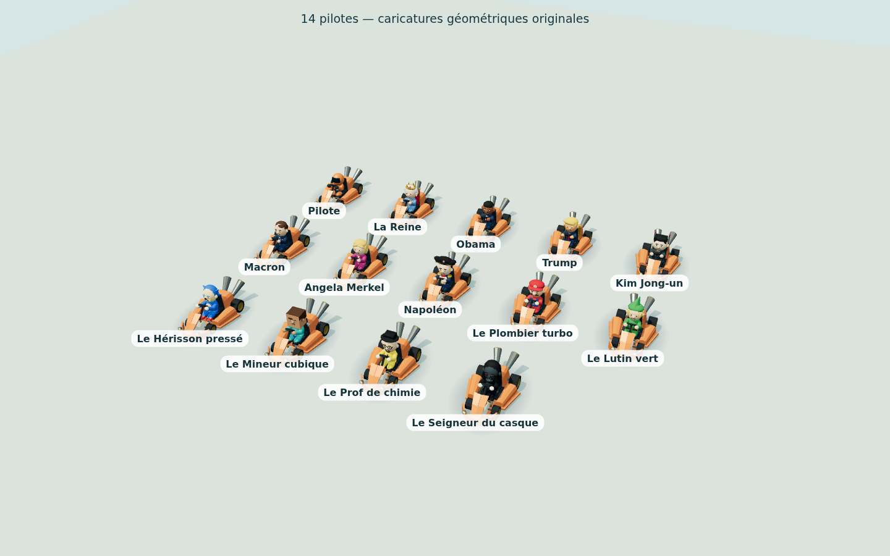

# Personnages cartoon

Le garage dispose de **quatorze pilotes**, compatibles avec chacun des trois châssis.
Aux cinq personnages d’origine s’ajoutent neuf caricatures : trois figures politiques
et six clins d’œil aux jeux vidéo, aux séries et au cinéma. Le personnage ambigu
a été retiré à la demande de l’utilisateur.

| ID | Personnage | Apparence et accessoire |
| --- | --- | --- |
| `racer` | Pilote | Casque intégral, visière sombre, combinaison aux couleurs du joueur |
| `queen` | La Reine | Caricature de reine britannique : cheveux argentés, couronne, perles, tenue bleue et mini-trône |
| `obama` | Obama | Caricature en costume bleu, cheveux courts grisonnants aux tempes, grandes oreilles, cravate et mini-pupitre avec micro |
| `trump` | Trump | Caricature à la mèche blonde exagérée, costume, grande cravate rouge et petit portique doré |
| `kim` | Kim Jong-un | Caricature au visage rond et à la coupe haute, veste boutonnée, siège avec deux antennes |
| `macron` | Macron | Costume bleu, cheveux courts, cravate électrique et petit badge tricolore |
| `merkel` | Angela Merkel | Carré blond ample, veste framboise, collier et pendentif losange |
| `napoleon` | Napoléon | Bicorne exagéré, cocarde, épaulettes et uniforme à double boutonnage |
| `plumber` | Le Plombier turbo | Casquette rouge, moustache, salopette et gros gants blancs |
| `elf` | Le Lutin vert | Bonnet pointu, oreilles allongées, ceinture et petit bouclier dorsal |
| `hedgehog` | Le Hérisson pressé | Piquants bleus, museau clair, gants blancs et chaussures rouges |
| `block` | Le Mineur cubique | Tête carrée, coupe en blocs, tenue turquoise et petite pioche dorsale |
| `chemist` | Le Prof de chimie | Chapeau noir, lunettes rondes, bouc et combinaison jaune |
| `space` | Le Seigneur du casque | Casque noir, masque, cape et panneau de commande coloré |



[Nouveaux pilotes, première série](characters/lineup-page-2.png) ·
[Nouveaux pilotes, deuxième série](characters/lineup-page-3.png).

Il s'agit de créations géométriques originales du projet, volontairement
cartoon, sans photographie, texture téléchargée, modèle de personne importé ni
service de génération. **Coût ajouté : 0 €.** Ces représentations parodiques ne
sont pas des produits officiels ni une indication de soutien des personnes
représentées. Aucun fichier de personnage tiers n'a été ajouté : les costumes
sont construits dans le code avec les primitives du projet. Les licences des véhicules importés restent décrites dans
[KART_MODELS.md](KART_MODELS.md).

## Construction et comportement

[`shared/characters.ts`](../shared/characters.ts) fournit les identifiants,
noms, descriptions et fonctions de validation. Les valeurs inconnues reviennent
au pilote casqué. Le choix ne change aucun paramètre de simulation ni de collision.

[`client/kart-character.ts`](../client/kart-character.ts) assemble les treize
caricatures à partir de sphères, cylindres, boîtes, cônes et anneaux Three.js.
Les primitives partagées sont dans [`character-shapes.ts`](../client/character-shapes.ts),
les nouveaux costumes dans [`character-politics.ts`](../client/character-politics.ts)
et [`character-popculture.ts`](../client/character-popculture.ts).
Les pièces rigides sont regroupées par matériau. Le modèle original du kart
reste importé avec `GLTFLoader` ; les personnages et accessoires sont ajoutés
à son repère de siège. Les bras sont ajustés au repère du volant de chaque
châssis.

`createKartModel(color, modelId = 'zsky', characterId = 'racer')` réutilise une
promesse de chargement par véhicule et un modèle préparé par couple
véhicule/personnage. Deux instances partagent les géométries et matériaux
fixes, mais possèdent leurs transformations et leurs peintures. Les visages
réagissent par transformation de pièces : aucun matériau partagé n'est modifié
pour animer une expression. La peinture du kart et les petits rappels sur la
tenue sont indépendants pour chaque joueur ; la peau et les traits distinctifs
gardent leur couleur.

Pendant la conduite, la tête suit légèrement le braquage et l'accélération.
Un impact fait osciller la tête, monter les sourcils et ouvrir la bouche des
caricatures. À l'arrivée, elles sourient et saluent du bras ; le pilote casqué
accompagne la célébration par des mouvements de tête. Les accessoires restent
attachés à leur groupe de tête ou de carrosserie. Ces effets ne modifient jamais les coordonnées,
la direction réelle, les entrées de conduite ou les collisions.

## Commandes de vérification

```sh
npm run typecheck
node --import tsx --test --test-concurrency=3 tests/characters.test.ts tests/garage.test.ts tests/kart-assets.test.ts tests/server.test.ts
node --import tsx scripts/characters-check.ts
node --import tsx scripts/characters-roster-check.ts
```

## Rendu du casting courant

La galerie et le [rapport JSON](characters/validation.json) sont régénérés pour
les **quatorze pilotes**, soit **84 instances** (trois châssis et deux peintures).
Ce périmètre représente 42 couples personnage/châssis. Les **6 contrôles
sont réussis**, sans erreur JavaScript ; maximum mesuré : **11 882 triangles
et 44 maillages**. Le catalogue et le repli de l’ancien identifiant `bean`
vers le pilote casqué passent aussi le test ciblé et la compilation.

Les six contrôles de rendu portent sur :

- Le chargement des trois GLB sur la même origine, une fois chacun, sans secours.
- Le partage des géométries et l’indépendance des peintures.
- Un impact appliqué à une seule instance, sans modifier les autres pilotes ni
  les entrées de simulation.
- Les expressions, mouvements de tête et saluts à l’impact et à la victoire,
  avec coordonnées inchangées et carrosserie au-dessus du sol.
- L’animation de conduite sur les 84 instances, sans mutation de la physique.
- La recoloration puis la recréation d’un couple personnage/véhicule sans
  téléchargement supplémentaire ni destruction des géométries partagées.

Les limites restent fixées à moins de 16 000 triangles et 55 maillages par
véhicule. Aucun GLB supplémentaire n’est téléchargé pour un personnage.

Portraits : [Pilote](characters/racer.png), [Reine](characters/queen.png),
[Obama](characters/obama.png), [Trump](characters/trump.png),
[Kim Jong-un](characters/kim.png), [Macron](characters/macron.png),
[Merkel](characters/merkel.png), [Napoléon](characters/napoleon.png),
[Plombier](characters/plumber.png), [Lutin](characters/elf.png),
[Hérisson](characters/hedgehog.png), [Mineur](characters/block.png),
[Prof](characters/chemist.png), [Seigneur du casque](characters/space.png).
[Salut de la Reine](characters/queen-victory.png).

Le retrait est déployé et vérifié dans Chromium via le tunnel : 14 options,
ancien choix restauré en pilote casqué, aperçu rendu et aucune erreur JavaScript.
[Rapport du retrait](characters/removal-browser.json) ·
[Garage actuel à 320 px](characters/removal-mobile-320.png).

## Historique : tests et réseau du lot initial à quinze pilotes

Les résultats ci-dessous concernent l’ajout initial du 7 octobre 2026, qui
comptait dix nouveaux pilotes. Ils ne valident pas le retrait ultérieur.

Le typage, la compilation et les **27 tests ciblés** des catalogues, du garage,
des assets et du serveur étaient réussis. Le catalogue rejetait notamment
objets, tableaux, URL et identifiants non autorisés. Le même flux de commandes
produisait les mêmes mouvements sur les 45 couples personnage/châssis du lot
initial, y compris les dix nouveaux pilotes.

Les **6 contrôles d’interface et de réseau privé** étaient réussis :
quinze choix accessibles, sélection conservée après rechargement, propagation
des dix nouveaux pilotes entre deux contextes Chromium et stats inchangées.
Le garage tenait à 320 × 568, avec un sélecteur tactile de 44 px. Un identifiant
local invalide revenait au pilote casqué. Un départ à huit karts, dont six CPU,
confirmait le rendu et la conduite des deux humains par commandes ordinaires,
sans coordonnées forcées. Aucun modèle de secours ni erreur JavaScript.
[Rapport initial](characters/roster-browser-validation.json) ·
[Garage desktop initial](characters/garage-roster-desktop.png) ·
[Garage mobile initial](characters/garage-roster-mobile-320.png) ·
[Départ à huit initial](characters/race-new-drivers-8-karts.png).

Lors de ce déploiement, Docker servait le même client que le build local ;
les 21 fichiers de sauvegarde présents avant le déploiement sont restés
identiques et le tunnel a été conservé.
[Contrôle du déploiement initial](characters/deployment.json).

**7 contrôles publics réussis** complétaient le test privé : deux navigateurs
indépendants sélectionnaient et partageaient les nouveaux pilotes via le
tunnel, rechargeaient leur choix puis démarraient et conduisaient avec les
commandes normales. Un GLB par navigateur, aucune erreur JavaScript ni
ressource manquante, aucun salon de test restant à la fin. Le public vérifiait
un changement de personnage ; le privé ci-dessus vérifiait chacun des dix
nouveaux IDs.
[Rapport public initial](characters/public/roster-browser-validation.json) ·
[Garage mobile public initial](characters/public/garage-roster-mobile-320.png) ·
[Départ public initial](characters/public/race-new-drivers-2-karts.png).

Ces contrôles utilisent Chromium avec SwiftShader : ils ne mesurent pas les
performances sur GPU ou téléphone physique. Le lot initial n’a pas rejoué une
course complète ni un championnat, et n’a pas testé deux machines physiques.
