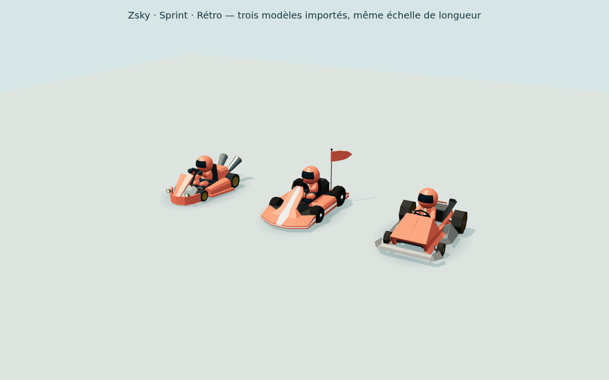

# Bibliothèque de karts gratuits

Trois modèles réellement différents sont embarqués dans le projet. Leur choix
est cosmétique : il ne change ni la trajectoire, ni la vitesse, ni le volume
de collision. Chaque modèle accepte les huit peintures de joueur.

| ID | Nom dans le jeu | Source gratuite | Licence | GLB servi | Triangles du véhicule |
| --- | --- | --- | --- | --- | --- |
| `zsky` | Zsky | [Go Kart — Zsky](https://poly.pizza/m/MkByxZCSMA) | [CC BY 3.0](https://creativecommons.org/licenses/by/3.0/) | `/models/kart-zsky-v1.glb`, 94 668 octets | 1 680 |
| `sprint` | Sprint | [Go kart — Poly by Google](https://poly.pizza/m/3hkutVs0AAV) | [CC BY 3.0](https://creativecommons.org/licenses/by/3.0/) | `/models/kart-sprint-v1.glb`, 137 008 octets | 3 828 |
| `retro` | Rétro | [Kart — Ben Harrison](https://poly.pizza/m/bKDlM4mH7rg) | [CC BY 3.0](https://creativecommons.org/licenses/by/3.0/) | `/models/kart-retro-v1.glb`, 96 980 octets | 1 916 |

Le Zsky garde son carénage ouvert et ses phares. Le Sprint possède un nez allongé,
une bande claire et un fanion. Le Rétro a un capot anguleux, un pare-chocs ouvert
et des roues arrière plus grandes. Il ne s'agit pas de recolorations du même
véhicule. Le pilote géométrique du projet s'ajoute à chaque modèle.



## Téléchargement et inspection

Les pages officielles, les liens de licence et les métadonnées des fichiers ont
été vérifiés le **6 octobre 2026**. Les téléchargements des archives Zsky sur
OpenGameArt et Kenney Car Kit ont répondu HTTP 403 dans cet environnement. Les
deux modèles supplémentaires proviennent donc des téléchargements gratuits du
CDN officiel de Poly Pizza. Aucun service payant, compte, abonnement, API IA ni
nouvelle dépendance n'a été utilisé. Coût ajouté : **0 €**.

Les originaux et leurs aperçus, le texte complet de la licence, l'attribution,
les métadonnées de la page et les empreintes SHA-256 sont conservés dans :

- [`assets/sources/poly-google/`](../assets/sources/poly-google/)
- [`assets/sources/ben-harrison/`](../assets/sources/ben-harrison/)
- [`assets/sources/zsky/`](../assets/sources/zsky/) pour le modèle existant.

Les fichiers originaux restent intacts. Les deux nouvelles sources contiennent
**un seul mesh** avec plusieurs primitives de matériau, aucun squelette,
aucune animation et aucune texture. Elles ne comportent pas de roues séparées,
de pivots d'essieu ni de repères de pilote. Leurs transformations de nœud sont
identitaires ; les positions sont portées par les sommets.

| Source | Primitives | Matériaux | Orientation avant inspectée |
| --- | --- | --- | --- |
| Poly by Google | 4 | 4 unis | −X, hauteur +Y |
| Ben Harrison | 8 | 8 unis | +X, hauteur +Y |

La préparation identifie les quatre composants de pneus par connectivité des
positions. Les composants complets de pneu, disque et enjoliveur sont regroupés
autour de leur véritable axe ; les panneaux de carrosserie et les essieux
transversaux restent attachés à `Body`. On ne découpe pas les panneaux par un
simple test de triangles dans une boîte : cela ferait tourner des morceaux de
carrosserie avec les roues. Les normales planes et **tous les triangles de la
source** sont conservés.

## Conversion reproductible

```sh
python3 scripts/prepare-kart.py --check
python3 scripts/prepare-kart-library.py
python3 scripts/prepare-kart-library.py --check
```

Les scripts emploient uniquement la bibliothèque standard Python. Ils vérifient
le SHA-256 des sources, les tournent vers +Z, conservent leurs proportions à une
longueur de 3,8 m, placent les pneus au sol et produisent des GLB autonomes. Le
mode `--check` reconstruit en mémoire et compare les GLB et les rapports exacts.
Blender n'est nécessaire ni à cette préparation, ni au build, ni au jeu.

Les trois fichiers partagent le contrat `Body`, `Wheel_FL`, `Wheel_FR`,
`Wheel_RL`, `Wheel_RR`, `SeatMount`, `SteeringMount`. Les roues sont sœurs de la
carrosserie. Le rayon réel de chaque pneu est enregistré dans `extras.radius` ;
le roulement tourne sur X et les deux roues avant braquent autour de Y. Une
légère inclinaison de la carrosserie est appliquée au rendu seulement.

## Chargement et instances

[`shared/kart-catalog.ts`](../shared/kart-catalog.ts) fixe les identifiants,
labels et chemins locaux. Les valeurs inconnues reviennent à `zsky` ; un
identifiant ne peut pas demander une URL arbitraire.

`createKartModel(color, modelId = 'zsky')` utilise une promesse `GLTFLoader`
mise en cache **par modèle**. Plusieurs joueurs du même modèle partagent les
buffers de géométrie et les matériaux fixes. Les peintures du véhicule et du
pilote sont clonées par instance. Changer la peinture ou supprimer une instance
ne détruit pas les buffers communs.

Les fichiers sont versionnés et servis sur la même origine. Le navigateur ne
contacte pas Poly Pizza pendant le jeu. Un GLB manquant active l'ancien kart
de secours pour cet identifiant uniquement ; les autres modèles chargés restent
disponibles. `kartAssetDiagnostics().models[id]` expose le statut et le nombre
de chargements par modèle, en plus du bilan global compatible avec l'ancien
diagnostic.

## Vérifications exécutées

```sh
node --import tsx --test tests/kart-assets.test.ts
node --import tsx scripts/kart-library-check.ts
npm run typecheck
```

Les **6 tests assets** vérifient les trois sources et licences, les indices et
normales, le maintien du nombre de triangles, les pivots centrés, les quatre
pneus au sol, l'absence de panneaux peints dans les nouvelles roues et les
identifiants autorisés. Les deux convertisseurs sont reproductibles.

Les **5 contrôles Chromium** de la bibliothèque sont passés :

- 24 instances, huit par modèle : exactement trois téléchargements GLB, tous
  sur la même origine.
- Huit peintures indépendantes par modèle, géométries partagées entre copies.
- Quatre roues qui roulent, braquage des roues avant et inclinaison sans
  mutation des entrées ni des positions de simulation ; carrosserie au-dessus
  du sol.
- Recoloration isolée et suppression/recréation d'instance sans rechargement
  ni destruction de géométrie partagée.
- Blocage volontaire du seul GLB Rétro : secours limité à ses huit instances,
  Zsky et Sprint toujours importés, aucune erreur JavaScript.

Le [rapport JSON](kart-library/validation.json) et les captures
[Sprint](kart-library/sprint.png), [Rétro](kart-library/retro.png) et
[ensemble](kart-library/three-models.png) sont conservés et ont été inspectés.
La fixture utilise Chromium avec rendu logiciel SwiftShader : elle ne mesure
pas les performances d'un GPU. Les contrôles réseau de sélection, de course,
de reconnexion et de conservation du choix entre manches sont distincts de
cette validation de la bibliothèque et relèvent du rapport d'intégration.
