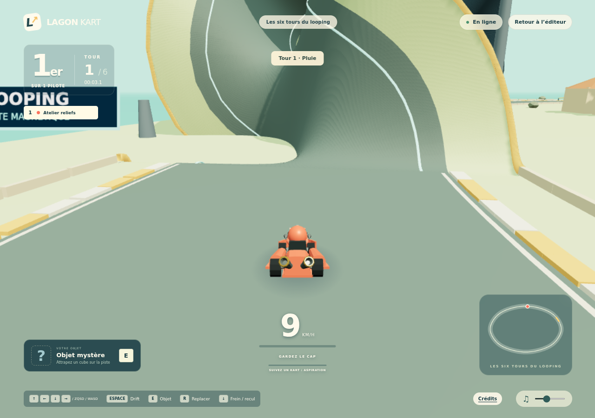
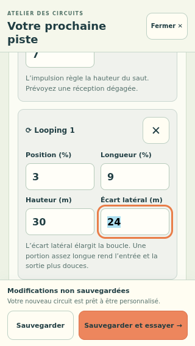
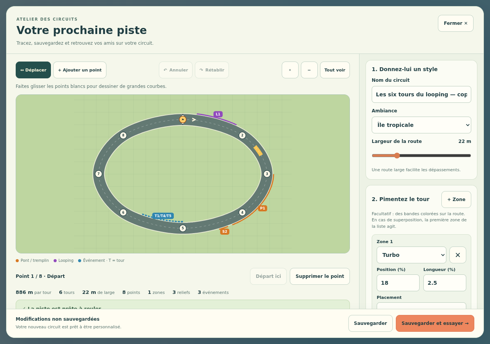
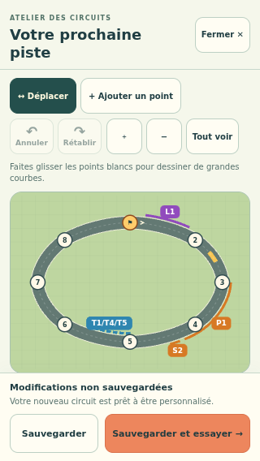

# Tours, reliefs et événements dans l’éditeur

Depuis **Créer un circuit**, trois sections permettent d’enrichir la course :

1. **Durée de la course** : choisissez de 1 à 20 tours. Cette durée appartient au circuit, y compris lorsqu’il fait partie d’un tournoi.
2. **Ponts, sauts et loopings** : ajoutez un module puis réglez sa position, sa longueur et sa hauteur. Un pont possède une approche pour adoucir ses pentes ; un tremplin possède une impulsion ; un looping possède un écart latéral. Les valeurs proposées donnent un point de départ à essayer.
3. **Événements par tour** : choisissez l’effet et le tour du leader qui le déclenche. L’événement dure ce tour et concerne tous les joueurs. Pluie, cendres et tempête créent une bande boueuse ; neige et glace créent du verglas ; turbo donne un coup d’accélérateur ; éclaircie calme la météo sans ajouter de bande.

**Position** et **Longueur** sont exprimées en pourcentage du tour, depuis le départ. Le plan indique les portions concernées ; **Sauvegarder et essayer** montre les volumes réels en 3D. Si des événements partagent exactement une zone, leur badge regroupe les tours concernés.

Annuler, rétablir, supprimer, le brouillon automatique et la duplication conservent ces nouvelles options. Réduire la durée d’une course n’efface pas ses événements : ceux programmés après l’arrivée sont signalés et doivent être ajustés avant la sauvegarde. Les anciens circuits gardent leurs trois tours tant que leur durée n’est pas changée.

## Vérifications exécutées

Le [parcours navigateur complet](browser-validation.json) a réussi ses six scénarios :

- Ancien format sauvegardé sans introduction d’options supplémentaires.
- Circuit configuré pour six tours avec pont, tremplin, looping et événements aux tours 1, 4 et 5 ; suppression, annulation et rétablissement.
- Restauration du brouillon après rechargement ; relecture des options dans l’API et le fichier JSON du serveur privé.
- Vraie course d’essai avec compteur 1/6, annonce de pluie au premier tour, looping visible, accélération normale et retour à l’éditeur.
- Duplication par un autre profil sur écran tactile 320×568, modification indépendante et sauvegarde ; contrôles d’au moins 44 px, sans débordement.
- Deux navigateurs connectés au même salon sur la révision du circuit sauvegardée ; fermeture des salons ensuite.





Le [contrôle visuel final](visual-validation.json) vérifie en plus les badges regroupés et les pastilles de couleur sur le dernier build, en desktop et mobile. Il réutilise le brouillon déjà validé comme fixture visuelle, ouverte normalement avec **Dupliquer** ; il ne prétend pas refaire les courses ni la sauvegarde.





Le parcours utilise des données et un serveur temporaires, puis les supprime. Aucune trajectoire n’est imposée dans ce test. Le scénario ne termine pas les six tours : les tours tardifs et les événements sont vérifiés séparément par les tests de simulation. Téléphone physique et Safari iOS restent à essayer.

Reproduction :

```sh
npm run build
node --import tsx scripts/editor-features-browser-check.ts
```
