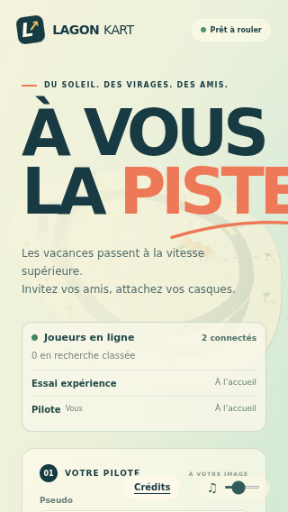
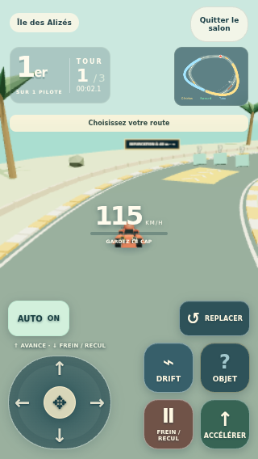

# Conduite, soirées et confort d’utilisation

Lot du 7 octobre 2026. Les huit améliorations acceptées sont développées ensemble : contacts de rail selon leur angle, enchaînements, objets de remontée, relais d’équipe, plaques interactives, essais de passage dans l’éditeur, soirées avec votes et faits marquants, mode Couronne.

Les preuves de validation finale sont consignées dans [VALIDATION.md](../../VALIDATION.md) après exécution. Les observations suivantes concernent le build de départ, avant ce lot.

## Livraison du lot

- [Conduite, enchaînements, remontées et relais](../race-fun/README.md).
- [Plaques interactives et essai ciblé dans l’éditeur](../interactive-workshop/README.md).
- [Soirée, Couronne, faits marquants et replay partagé](../party-crown/README.md).
- [407 tests réussis](unit-validation.json) ; build et Docker réussis.
- [Déploiement avec conservation des données et du tunnel](deployment.json).
- [Trois parcours publics à deux profils réussis](../party-crown/public/browser-validation.json), sans fixture de simulation ; neuf propositions UX ci-dessous restent à réaliser.

## Essai de l’expérience existante

[Rapport de départ](baseline/audit.json). Actions ordinaires dans Chromium, serveur et données privés : accueil ordinateur, création/sortie d’un salon, mobile 320 × 568, entraînement avec départ réel, conduite AUTO, retour, ouverture/fermeture de l’éditeur, puis rotation du viewport. Aucun état de course n’est imposé par le script. Aucune erreur JavaScript.

Le rendu est logiciel avec SwiftShader. La mesure ponctuelle de 15 images/s en course et le passage automatique en qualité légère ne prédisent pas la fluidité sur le GPU d’un téléphone ou d’un ordinateur. Le parcours ne termine pas une course et ne remplace pas un essai humain.





## Améliorations d’ergonomie proposées après cet essai

Ces propositions restent distinctes des huit ajouts acceptés. Elles sont fondées sur le parcours observé ; leur confort devra être confirmé par les joueurs.

| Observation | Proposition | Critère d’essai |
| --- | --- | --- |
| À 320 × 568, le bouton Entraînement commence à y=986 px et le script fait défiler le menu de 827 px pour l’atteindre. Sur ordinateur 1440 × 900, Créer est partiellement sous le premier écran. | Un accueil centré sur Jouer / Rejoindre, avec le pilote mémorisé et les options Compte / Garage disponibles ensuite. | Un nouveau joueur trouve comment partir sans faire défiler l’accueil ni recevoir d’explication. |
| Le grand titre dépasse la largeur du viewport de 320 px. | Adapter le titre au petit écran et réserver davantage de place à l’action principale. | Aucun texte important coupé en portrait, paysage ou avec une police agrandie. |
| Dans le salon, les réglages et le garage précèdent les participants et le bouton Prêt ; le bas demande un défilement. | Une barre de préparation toujours visible : Prêt, nombre de pilotes prêts et prochaine action attendue. Réglages avancés repliés. | Chaque participant comprend ce qui empêche le départ sans consulter un autre écran. |
| Le compteur de vitesse se superpose au kart sur la capture portrait ; commandes, annonces et mini-carte occupent une grande partie de l’écran. | Replacer les informations autour de la route ; proposer une disposition des commandes adaptée aux préférences du joueur. | Kart et prochain virage visibles pendant une accélération, un saut et un événement ; commandes utilisables sans appui accidentel. |
| Le dessin de l’éditeur est visuel, mais les réglages des modules utilisent des positions en pourcentage plus bas dans le panneau. | Sélectionner puis déplacer directement une plaque, une zone ou un looping sur le plan ; afficher ses réglages au toucher. | Un débutant place un module voulu sans calculer de pourcentage. |
| La qualité baisse automatiquement après plusieurs secondes lentes et le décor continue de s’animer derrière certains menus. | Un choix explicite Automatique / Fluide / Détaillé et un rendu de menu plus sobre, avec suspension derrière les dialogues opaques. | Comparer la réactivité des menus et la cadence sur les appareils réels ; conserver les mêmes règles physiques. |
| Le mobile affiche simultanément AUTO ON, un joystick ↑/↓ et les boutons Accélérer/Frein. | Deux modes nommés clairement : accélération automatique et conduite manuelle, avec une aide adaptée au mode choisi. | Un débutant démarre, freine et recule sans explication orale. |
| L’atelier propose Essayer, Sauvegarder et Sauvegarder et essayer ; l’essai publie d’abord une version. | Distinguer le brouillon privé d’un bouton Publier pour la classe ; permettre de tester le brouillon avant partage. | Plusieurs essais successifs ne changent pas le catalogue public ; seule la version volontairement publiée y apparaît. |
| Le salon partage un code et un lien, ce qui demande une recopie entre ordinateur et téléphone voisin. | Un QR généré localement et le partage natif sur mobile. | Un collègue rejoint le bon salon en scannant, sans ressaisir le code. |

Reproduction de l’audit contre un serveur privé déjà lancé :

```sh
BASE_URL=http://127.0.0.1:3108 node --import tsx scripts/experience-audit.ts
```

Le script écrit dans `docs/fun-experience/baseline` par défaut ; définir `REPORT_DIR` pour conserver une nouvelle mesure séparée.
