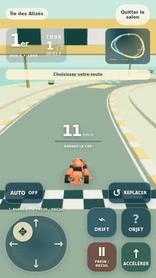
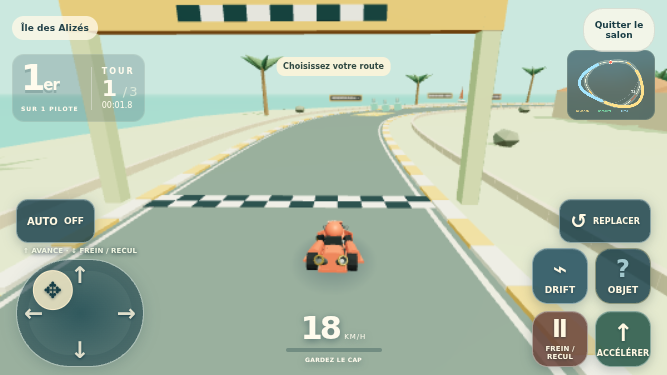
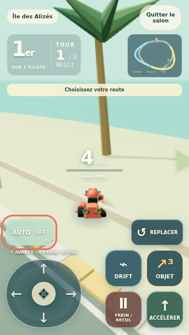

# Joystick mobile à deux axes

Le joystick permet désormais de glisser vers le haut pour accélérer, vers le bas pour freiner puis reculer, et en diagonale pour tourner en même temps. Le bas reste prioritaire sur AUTO et sur la pédale d’accélérateur. Avec AUTO désactivé, le relâchement coupe les gaz ; avec AUTO activé, il reprend l’accélération automatique.

## Vérification exécutée

Le [rapport privé](validation.json) contient **12 contrôles réussis**, sans erreur JavaScript, sur le bundle `index-CWZ4_iAy.js` / `index-C9CS0-o2.css` :

- Portrait 320 × 568 et paysage 667 × 375 : commandes dans l’écran, sans chevauchement, cibles d’au moins 44 px.
- Gestes tactiles Chromium réels : avant, frein/recul, diagonales, relâchement et AUTO ON/OFF. Les entrées reçues par Colyseus et les vitesses du kart sont lues pour vérifier le résultat.
- Plusieurs doigts : joystick avec drift ou objet ; relâchement d’un doigt indépendant des autres.
- Priorité du frein/recul sur les pédales et AUTO.
- Annulation tactile, perte de focus simulée, rotation de l’écran et maintien du clavier existant.

Un nouvel entraînement est lancé par l’interface pour chaque format, afin que le déplacement pendant une capture n’influence pas le scénario suivant. L’unique état de jeu imposé est un triple turbo attribué au kart du serveur privé pour mesurer une charge consommée par pression. Les trajectoires et vitesses restent produites par les commandes normales.







## Reproduire

```sh
npm run build
node --import tsx scripts/mobile-stick-check.ts
```

Le script crée puis supprime son serveur local et ses données temporaires. Pour un contrôle léger d’un déploiement déjà autorisé, `BASE_URL` sélectionne une origine externe et écrit les résultats dans `docs/mobile-stick/public/` : ce mode utilise les commandes ordinaires, dont **Replacer**, sans accès ni mutation de l’état serveur. Il ne remplace pas la vérification privée des entrées et objets.

Téléphone physique et Safari iOS restent à tester. Les images proviennent de Chromium avec écran tactile émulé et rendu SwiftShader.
